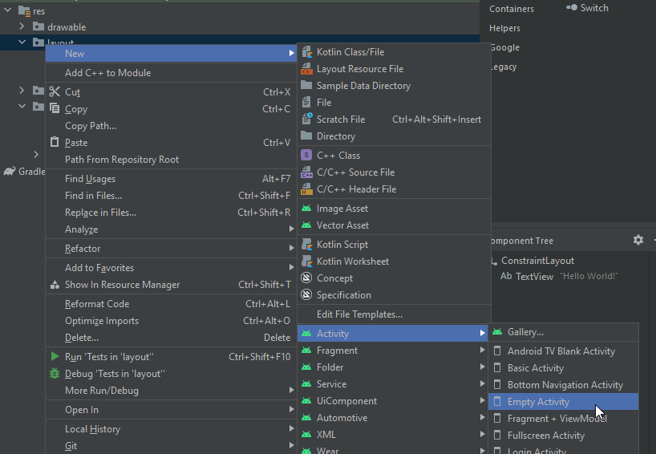

# android-java-two-activity

# 👉 Step 1:
Create a new app with empty activity.

# 👉 Step 2:
Creating a new empty activity, name is: `activity_second`



# 👉 Step 3:
Add some values into re/values/strings.xml:
```XML
<string name="tv_activity1_text">This is the 1st Activity</string>
<string name="tv_activity2_text">This is the 2nd Activity</string>
<string name="btn_activity1_text">Open the 2nd activity</string>
<string name="btn_activity2_text">Go back to the 1st Activity</string>
<string name="toast_activity1_text">Button is pressed on activity 1</string>
<string name="toast_activity2_text">Button is pressed on activity 2</string>
```